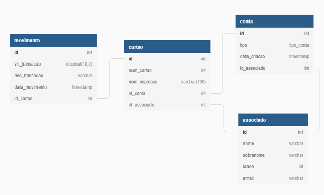
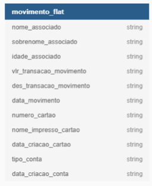
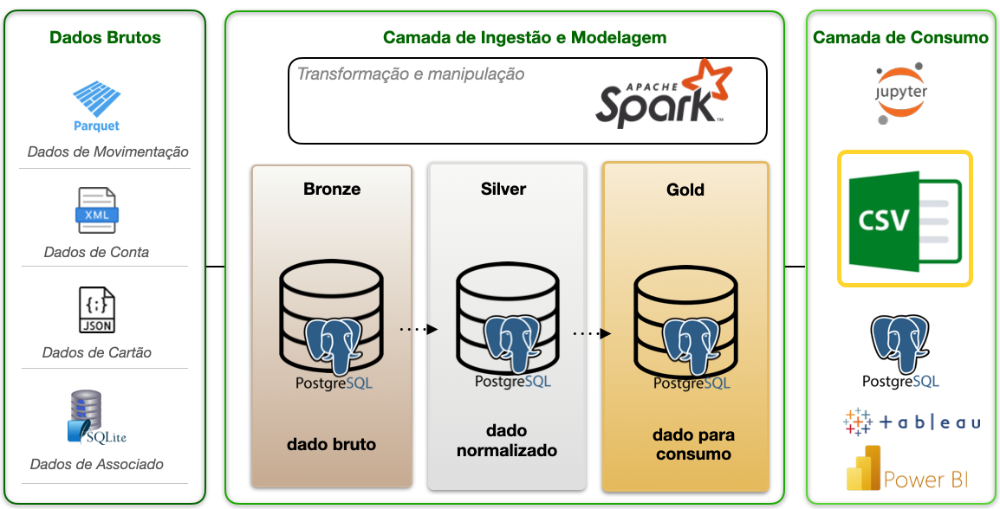

# Desafio Engenharia de Dados

## :nerd_face: Descrição do projeto

> Realizar uma POC de um novo datalake utilizando dados de cartões para o teste. Deve-se considerar a seguinte estrutura de tabelas:



> Ao final deve ser gerado e exportado em arquivo .csv a seguinte estrutura de informações:




## 📌 Índice
- [Sobre o Projeto](#-sobre-o-projeto)
- [Tecnologias Utilizadas](#-tecnologias-utilizadas)
- [Como Rodar o Projeto](#-como-rodar-o-projeto)
- [Estrutura do Projeto](#-estrutura-do-projeto)
- [Imagens e Diagramas](#-imagens-e-diagramas)
- [Contribuição](#-contribuição)
- [Licença](#-licença)

---

## 📖 Sobre o Projeto

📌 Breve explicação sobre o que o projeto faz e qual problema resolve.

> Exemplo: "Este projeto é um ETL desenvolvido em Apache Airflow para processar e transformar dados financeiros."

---

## 🛠 Tecnologias Utilizadas

As principais tecnologias usadas no projeto são:

- **🛠 Linguagem:** Python 3.9
- **📊 Data Pipeline:** Apache Spark
- **🛢 Banco de Dados:** PostgreSQL
- **🐳 Containers:** Docker e Docker Compose

---

## 🚀 Como Rodar o Projeto

### **1️⃣ Pré-requisitos**
Antes de iniciar, instale:
- [Docker](https://docs.docker.com/get-docker/)
- [Docker Compose](https://docs.docker.com/compose/install/)

### **2️⃣ Clone o repositório**
```sh
git clone https://github.com/seu-usuario/seu-projeto.git
cd seu-projeto



